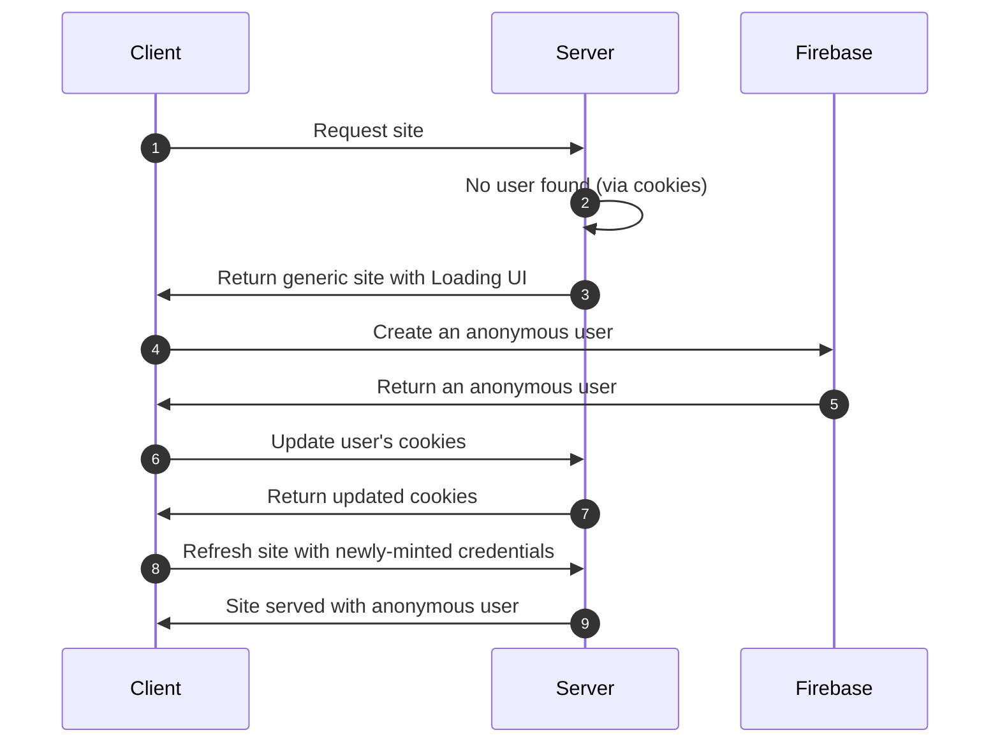
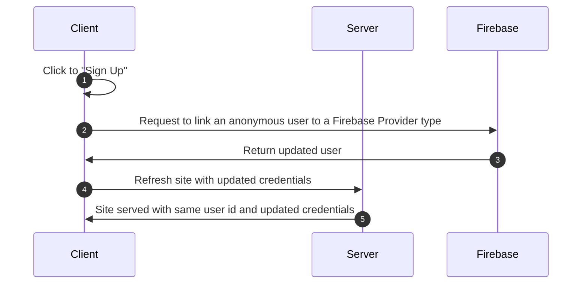
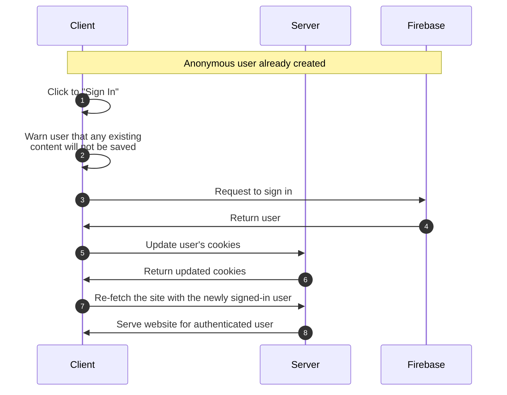
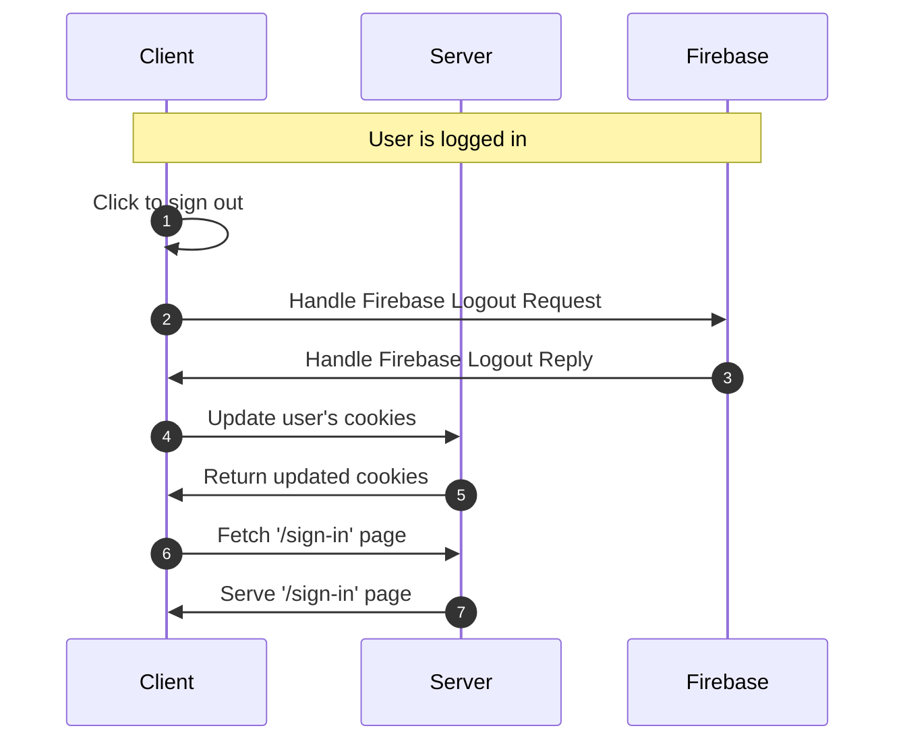
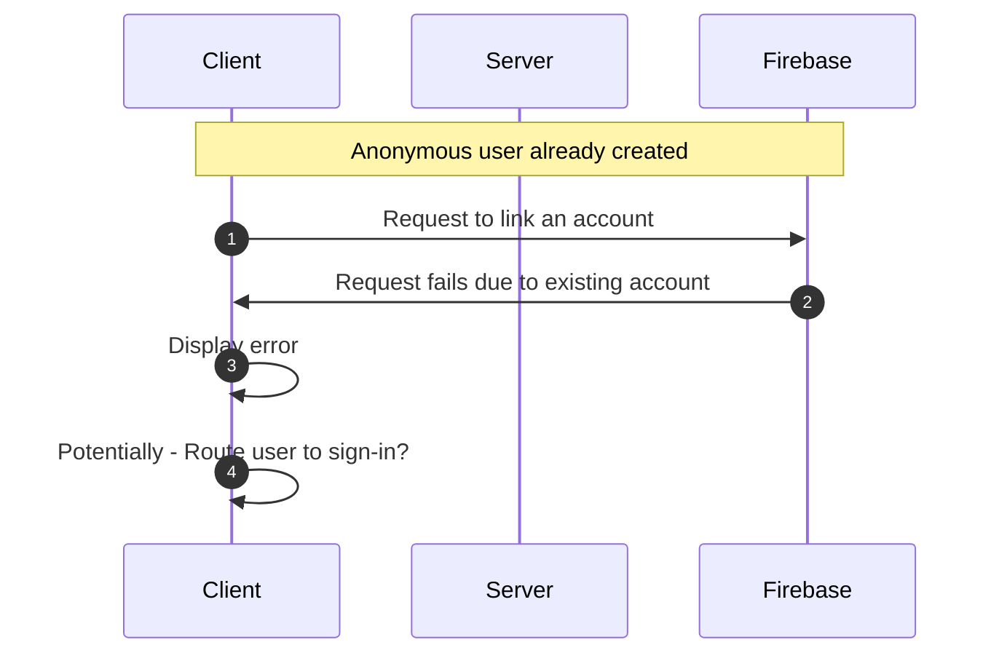

# Firebase User flows with Anonymous Users

## Checkout the live site [here](https://nextjs-firebase-server-cookies.vercel.app/)

This is a minimal webapp which showcases some of the most common "user flows" with Firebase Auth. One distinct feature of this project is that we offer persistent data for a user, even if they haven't yet created an account, and we maintain that data for the user once they create an account.

## Firebase Sign In Redirect Setup

When setting up support for sign-in I followed instructions from [this Github comment](https://github.com/firebase/firebase-js-sdk/issues/7342#issuecomment-2133453309)

<details>
  <summary>Firebase Config Setup Details</summary>
(Copied directly from that comment)  
For people who use Next.js and do not use Firebase Hosting, try option 3 from https://firebase.google.com/docs/auth/web/redirect-best-practices. I could make it work by following these steps:
 
1. Set `authDomain` to localhost or production-url based on current environment.
2. Use Next.js Rewrites to create a reverse-proxy
3. Add "authorized redirect uris" in Google Cloud.
4. Use --experimental-https flag to make localhost https

[1] In `firebase.ts`, replace the `authDomain` based on the current environment.

```
const env = process.env.NODE_ENV
if (env == "development") {
    firebaseConfig.authDomain = "localhost:<port>";
} else if (env == "production") {
   firebaseConfig.authDomain = "<production-url>";
}
```

[2] In next.config.mjs, add a Rewrite to proxy requests to /\_\_/auth/:path\* to Firebase Auth

```
async rewrites() {
    return [
	{
		source: '/__/auth/:path*',
		destination: 'https://<project>.firebaseapp.com/__/auth/:path*',
	},
    ]
},
```

[3] In Google Cloud > API & Services > Credentials > OAuth 2.0 Client IDs > , add under "Authorized redirect URIs" the following uris:

- [https://localhost:[PORT]](https://localhost:%5BPORT%5D)
- [https://localhost:[PORT]/\_\_/auth/handler](https://localhost:%5BPORT%5D/__/auth/handler)
- https://[PRODUCTION_URL]
- https://[PRODUCTION_URL]/\_\_/auth/handler

From Google Cloud: "Note: It may take 5 minutes to a few hours for settings to take effect" <-- I second that, for me it was 1-2 hours actually.

[4] If you start your Next.js application now in development mode, e.g. `next dev`, make sure to add the `--experimental-https` flag to make localhost use https. With that, you should be able to use `signInWithRedirect` in all browsers, including Safari and Firefox.

</details>

#### Things this doc does not cover (yet)

- Password reset / recovery via email
- MFA support
- GDPR support
- Account deletion
- Purging anonymous accounts > 30 days old

### User definitions

| Type of user   | Description                                                                                                       |
| -------------- | ----------------------------------------------------------------------------------------------------------------- |
| **Anonymous**  | A placeholder user that is not attached to an auth provider, but allows us to keep track of the person's session. |
| **Registered** | A user that has created an account and has a valid email associated with their account                            |

## Key User Flows

- [Creating an anonymous user](#creating-an-anonymous-user)
- [Upgrading an anonymous user to a registered user](#upgrading-an-anonymous-user-to-a-registered-user)
- [Signing in](#signing-in)
- [Signing out](#signing-out)
- [Handle attempting to register an existing email address](#handle-attempting-to-register-an-existing-email-address)

### Creating an anonymous user

This happens during a user's first visit to the website regardless if they have an account or not.



### Upgrading an anonymous user to a registered user

An anonymous user will be able to "Sign Up". In this flow we convert the anonmyous user to a registered user, while maintaining their user id and existing data created while an anonymous user.



### Signing In

An anonymous user will be able to "Sign In". In this flow we ditch the anonymous user and load the regular user.



### Signing out



### Handle attempting to register an existing email address


